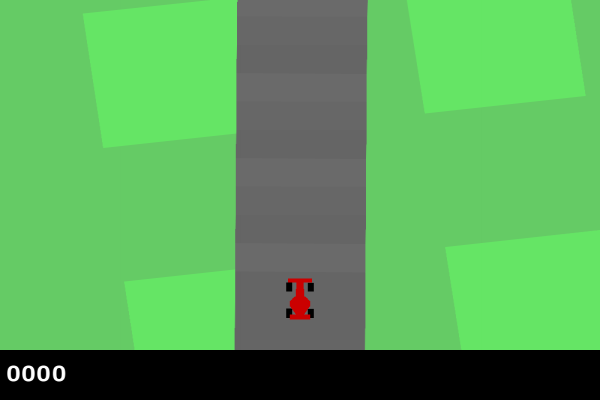

# Car Racing. Projet INF581

## Table of Contents
- [Description](#description) 📝
- [Installation](#installation) 🛠
- [Usage](#usage) 🚀
  - [Running Models (run.py)](#running-models-runpy) 🏃‍♂️
  - [Training Models (train.py)](#training-models-trainpy) 🎓
- [Repository Structure](#repository-structure) 📁
- [References](#references) 📚

## Description 📝
This project contains scripts for running and training reinforcement learning models in the Gymnasium's CarRacing environment. For more details about what it is about, check the ```report.pdf``` file.

The implemented models include Deep Q-Network (DQN), Proximal Policy Optimization (PPO), Cross-Entropy Method (CEM), and Deep Deterministic Policy Gradient (DDPG).

Below a small demonstration of one trained model in action:


It includes two main scripts: `run.py` for executing trained models and `train.py` for training new models.


## Installation 🛠️
Before running the scripts, make sure you have installed the required dependencies by running:
```bash
pip install .
```

## Usage 🚀

### Running Models (run.py) 🏃‍♂️
To run a trained model, use the `run.py` script with the following options:
- `--model`: Specify the model to use. Choose from "DQN", "PPO", "CEM", or "DDPG".
- `--load-path`: Path to the saved model weights.
- `--mode`: Choose between "gif" or "play" mode.  
    - `gif`: Produce a gif named "episode.gif".
    - `play`: Open a Pygame window using the model to play an episode.

Example usage:
```bash
python run.py --model DQN --load-path trained_models/dqn_500_steps.pt --mode play
```

Be sure to select a model compatible with the saved weights.

### Training Models (train.py) 🎓
To train a new model, use the `train.py` script with the following options:
- `--model`: Specify the model to train. Choose from "DQN", "PPO", "CEM", or "DDPG".
- `--save-path`: Path to save the trained model weights.

Example usage:
```bash
python train.py --model PPO --save-path /path/to/model/weights
```

## Repository Structure 📁
    .
    │
    ├── run.py                     # Script for executing trained models
    ├── train.py                   # Script for training new models
    │
    ├── src/                       # Source code directory
    │   ├── models/                # Directory containing model implementations
    │   │   ├── ...                # Model implementation files
    │   │   └── __init__.py        # Init file for models package
    │   │
    │   ├── envs/                  # Directory containing environment implementations
    │   │   ├── ...                # Environment implementation files
    │   │   └── __init__.py        # Init file for envs package
    │   │
    │   └── utils.py               # Utility functions used across the project
    │
    ├── trained_models/            # Directory for storing trained model weights
    │   └── ...                     # Saved model weights files
    │
    └── README.md                  # Project documentation 

## References 📚
- Read. Lecture VI - Reinforcement Learning III. In *INF581 Advanced Machine Learning and Autonomous Agents*, 2024.
- Schulman, J., Wolski, F., Dhariwal, P., Radford, A., & Klimov, O. (2017). Proximal Policy Optimization Algorithms. arXiv:1707.06347.
- Lillicrap, T. P., Hunt, J. J., Pritzel, A., Heess, N., Erez, T., Tassa, Y., ... & Wierstra, D. (2015). Continuous control with deep reinforcement learning. arXiv:1509.02971.
- Rubinstein, R. (1999). The cross-entropy method for combinatorial and continuous optimization. Methodology and computing in applied probability, 1, 127-190.
- Schulman, J., Levine, S., Moritz, P., Jordan, M. I., & Abbeel, P. (2015). Trust Region Policy Optimization. In Proceedings of the 32nd International Conference on Machine Learning (ICML-15) (pp. 1889-1897).
- *Solving Car Racing with Proximal Policy Optimisation*, [link](https://notanymike.github.io/Solving-CarRacing/), accessed 10 March 2024.
- *Car Racing - Gymnasium Documentation*, [link](https://gymnasium.farama.org/environments/box2d/car_racing/), accessed 10 March 2024.
